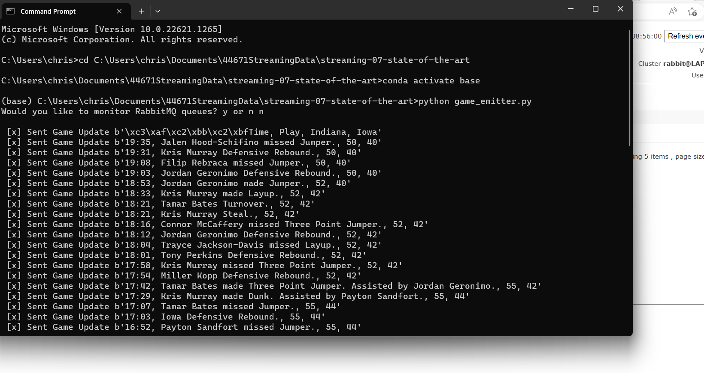
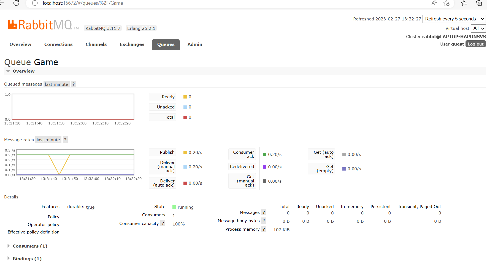
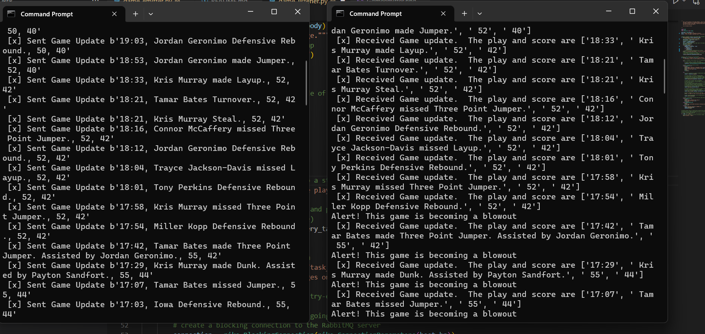
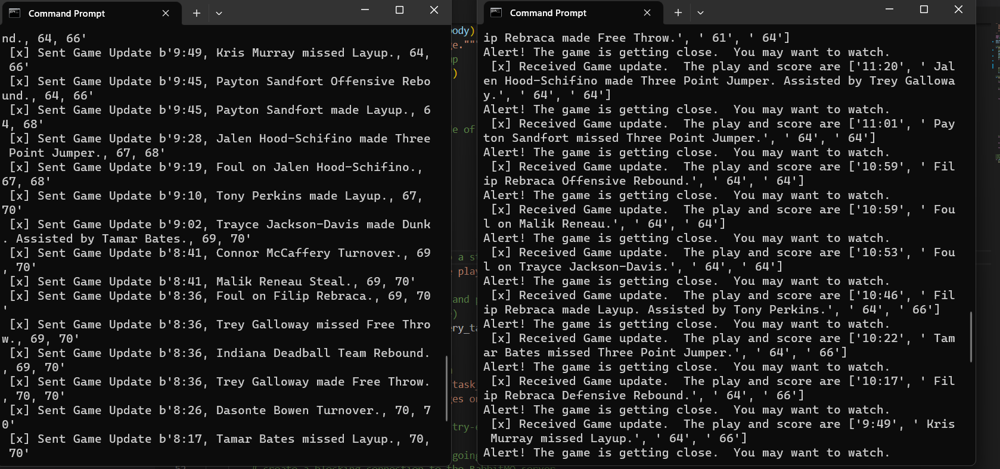

# Streaming-07-state-of-the-art

## Streaming Game Data
## Chris Kollbaum 2/25/2023

# What is this project?

I am a big sports fan and a big Iowa fan, so when a classmate reminded me of this data on our discussion board, this seemed like a good option for this custom project.  This project is streaming the progress of the Iowa-Indiana Basketball Game.  It will send the score updates to the "Game" queue and will be received by a listener.  This listener will give score alerts that will alert the person receiving these updates to whether the game may turn into a blowout or whether the game is getting close and you need to tune in.  The data was from ESPN.com https://www.espn.com/mens-college-basketball/playbyplay/_/gameId/401484874

## Alerts
The code for the consumer will alert the consumer if either team is ahead by more than 10 points saying that the game has the potential to become a blowout.  If the game gets within 2 points, it will send out another alert saying that it is a tight game and you should start paying attention.  

## Game Emitter

This code captures data from a file and sends it to the game queue.

## RabbitMQ Admin Site and Game Queue

## Game Consumer

I decided to just make one game consumer.  The data goes together.  It, to me, doesn't make much sense to split up the data as we did with the smart smoker project where it did make sense.  Here, the time, play, and score are really interrelated.  

This is a screenshot of the emitter and consumer.  Notice that the first alert has been triggered of the game potentially
becoming a blowout.

This is another screenshot of the emitter and consumer.  Notice that the second alert has been triggered of the game getting 
really close and if we are not watching, we should start paying attention.  

